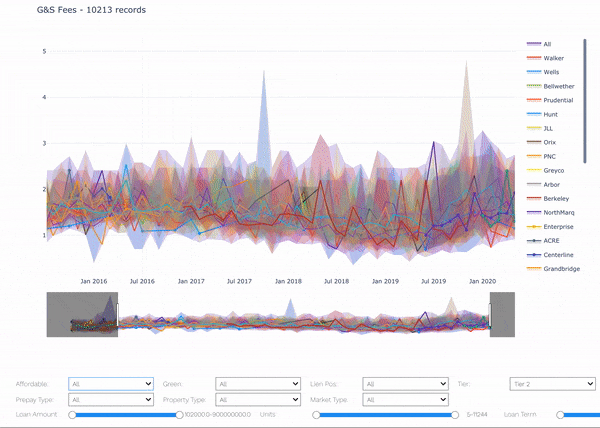
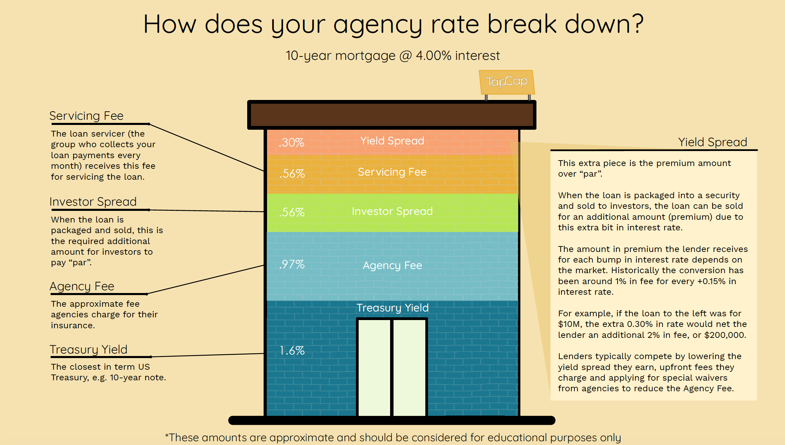

# Agency-G-S-Analysis

[Interactive Demo](./chart.html)
*Note: Demo doesn't contain all possible toggles and features. Please see notebook for full feature.*

## Discussion
Fannie Mae insures billions in multifamily mortgage backed securities. For the insurance, Fannie charges a Guaranty fee ("G" fee), which is akin to a insurance premium. That fee is a tack-on to the monthly debt service payments on the mortgage. 

Additionally, the seller/servicer of the loan participates in a risk-share with Fannie in the case of default. In return for the servicing *plus* risk, the servicer makes a monthly fee ("S" fee); that fee is also tacked on to the mortgage rate. 

For more info on how this fee works, see here: https://blog.tapcap.co/what-goes-into-an-agency-rate

The amounts of the G&S fee is decided by Fannie Mae. Fannie, in order to incentivize affordable housing development and other ["mission rich"](https://capmrkt.fanniemae.com/loan-we-all-own/index.html#nineteen) production, may reduce their G&S fee, which in turn lowers the overall rate a borrower must pay on a Fannie insured mortgage. 

Additionally, Fannie has granted further pricing "waivers" in order to deliver competitive rates to the market.

Lenders try to push for as many pricing waivers and other reductions on behalf of their clients. Each lender claims as a markting tactic that they achieve more pricing waivers and thus, lower rates for their clients than anyone else.

This analysis looks at the G&S fees lenders achieved for their clients across market-rate, affordable, "green" and seniors housing to look at whether any specific lender has historically outperformed in this claim.

## Data
The data set is proprietary and sourced directly from all Fannie Mae servicing records. If you would like access, please email your request hello@tapcap.co

## Viewing the notebook and accompanying graph

Github can usually display the notebook. In case of a loading error, view the notebook here:

https://nbviewer.jupyter.org/github/ZachariahRosenberg/Agency-G-S-Analysis/blob/main/fnma_g_s_fee.ipynb

The final graph has multiple toggles to change the data view. These are largely implemented with ipywidgets, and require the notebook to be running. However a demo can be found by opening the `./chart.html` file. That has the following inputs:

- Date Range: May 2015 - May 2020
- Market Rate (No LIHTC/Affordable)
- No Green Rewards
- 1st Lien position
- All tiers
- All Prepay
- Only multifamily (no Seniors, Student or MHC)
- All Markets
- All Lenders

You can toggle lenders on and off to compare.

[Interactive Demo](./chart.html)